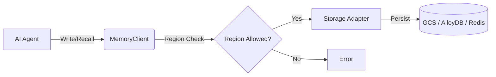

# Agent Memory Hub: Region-Governed Memory for AI Agents

[](https://pypi.org/project/agent-memory-hub/)
[](https://pypi.org/project/agent-memory-hub/)
[](https://github.com/sgmoorthy/agent-memory-hub/actions/workflows/ci.yml)
[](https://sgmoorthy.github.io/agent-memory-hub/)
[](LICENSE)

**Agent Memory Hub** is the enterprise-standard solution for managing **long-term memory for AI agents** with strict **region governance**. Designed for developers building scalable agentic workflows, it provides a unified interface to store, recall, and manage agent state across diverse storage backends while ensuring compliance with data residency laws (GDPR, CCPA).

Whether you are building a simple chatbot or a complex multi-agent system, `agent-memory-hub` abstracts the complexity of state management, letting you focus on agent logic.

---

## 🚀 What is Agent Memory Hub?

Agent Memory Hub is a Python SDK that acts as a middleware between your AI agents (built with LangChain, AutoGen, OpenAI, etc.) and your storage infrastructure. It creates a structured "brain" for your agents where every interaction, fact, or retrieved context is indexed by **Agent ID** and **Session ID**.

Crucially, it introduces **Region Governance** as a first-class citizen. You can strictly enforce that an agent's memory never leaves a specific geographic region (e.g., `europe-west1`), which is critical for enterprise applications handling sensitive user data.

## 💡 Why Use It?

- **Data Sovereignty & Compliance**: Native support for **region governance**. If an agent is configured for `europe-west1`, the SDK physically prevents writes to `us-central1` storage buckets.
- **Backend Agnostic**: Switch from **Google Cloud Storage** to **AlloyDB**, **Redis**, or **Firestore** without changing your agent code.
- **Session Isolation**: Automatically segregates memories by session, making it perfect for conversational agents and RAG pipelines.
- **Production Ready**: Typed, tested, and security-scanned. No hardcoded secrets.

## ⚙️ How It Works

The library uses an **Adapter Pattern** to connect to various storage backends. When you initialize a `MemoryClient`, you specify the _Agent_, _Session_, and _Region_.



1. **Initialize**: Create a client with specific region constraints.
2. **Interact**: Use `.write()` to save state and `.recall()` to fetch context.
3. **Govern**: The SDK handles the routing and compliance checks transparently.

## 🛠️ Installation

```bash
pip install agent-memory-hub

# For specific backends
pip install "agent-memory-hub[alloydb]"
pip install "agent-memory-hub[redis]"
```

## ⚡ Quick Start & Examples

We provide ready-to-use examples for common scenarios:

### 1. OpenAI Agent Integration

Inject long-term memory into your OpenAI API calls to personalize responses.

- [View Example](examples/openai_agents_integration.py)

```python
from agent_memory_hub import MemoryClient
# ... initialization ...
memory.write("User prefers concise Python code.")
context = memory.recall()
# Inject 'context' into your system prompt
```

### 2. Multi-Region Architecture

Manage distinct compliance requirements for global user bases.

- [View Example](examples/multi_region_memory_architecture.py)

```python
# This client will ONLY write to EU-based storage
eu_memory = MemoryClient(agent_id="eu_bot", region="europe-west1", region_restricted=True)
```

### 3. RAG Agent with Memory

Enhance Retrieval-Augmented Generation (RAG) by caching retrieved context and user interactions.

- [View Example](examples/rag_agent_with_region_memory.py)

---

## 📚 Documentation

Full documentation is available at [https://sgmoorthy.github.io/agent-memory-hub/](https://sgmoorthy.github.io/agent-memory-hub/).

- [Benchmarking Guide](docs/benchmarking.md)
- [Security & Access Flow](docs/security_access.md)
- [Semantic Memory Models](docs/semantic_models.md)
- [API Reference](site/reference/index.html)

## 🤝 Contributing

We welcome contributions! Please check [CONTRIBUTING.md](CONTRIBUTING.md) and our [ROADMAP.md](ROADMAP.md).

## 🛡️ Security

This project adheres to strict security practices. See [SECURITY.md](SECURITY.md) for details.
