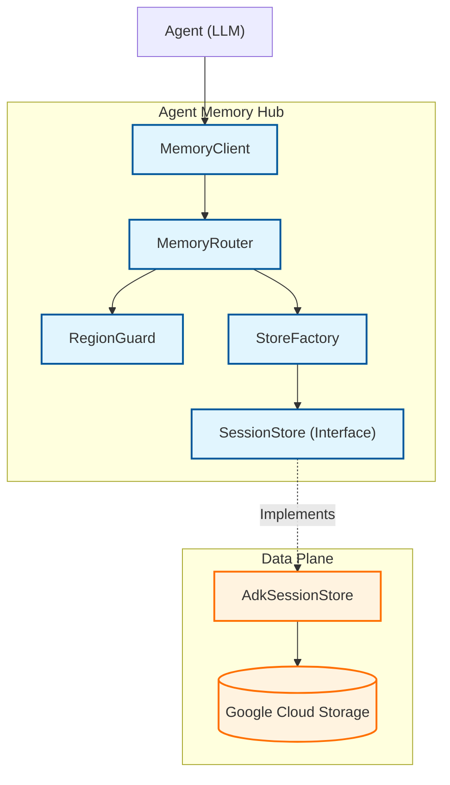
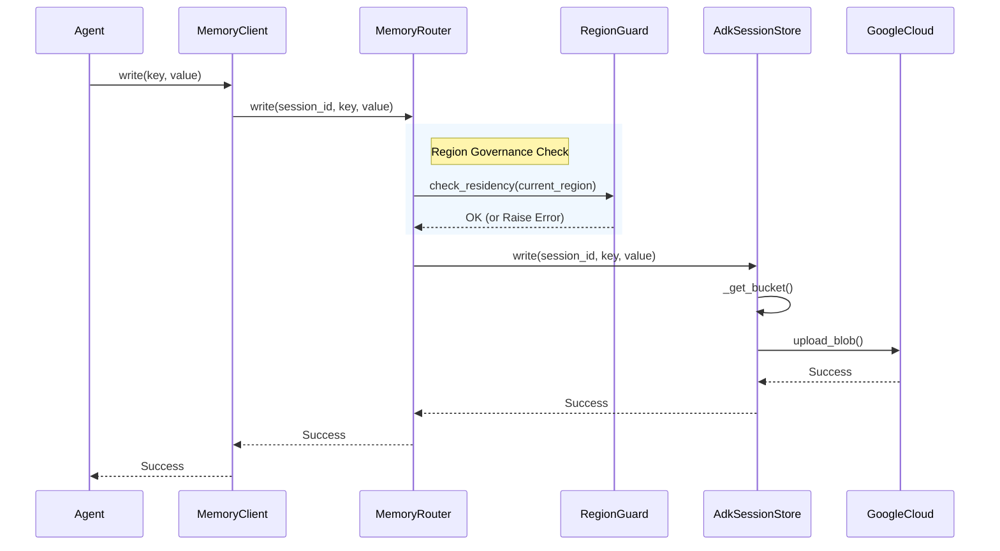
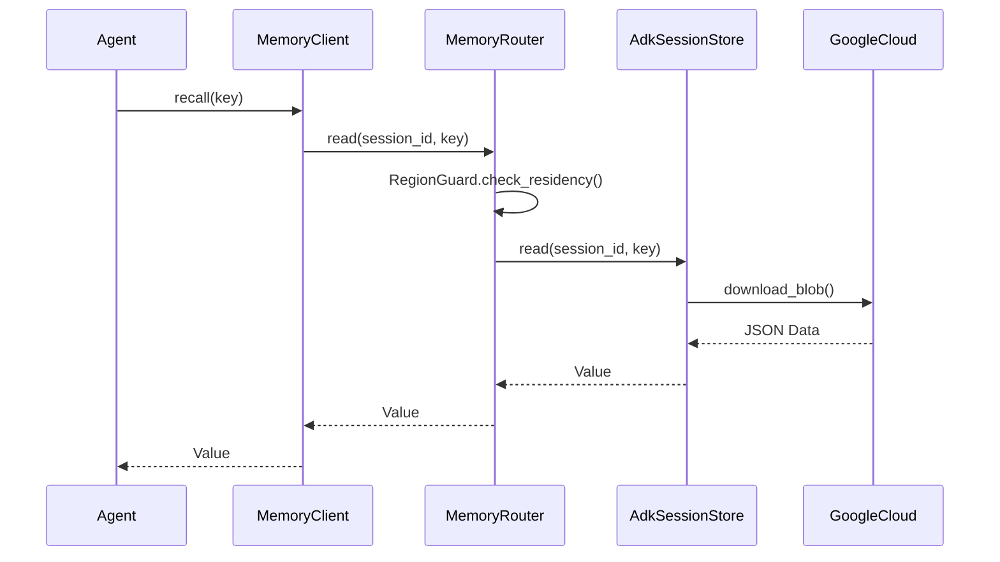
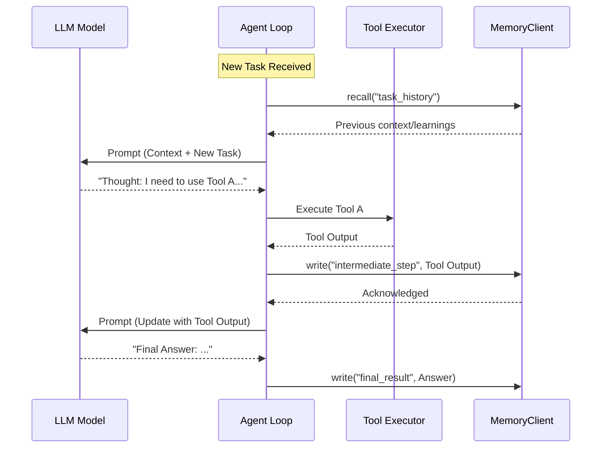

# Agent Memory Hub Architecture

This document describes the high-level architecture and data flow of the `agent-memory-hub` package.

## High-Level Architecture

The `agent-memory-hub` is designed with a layered architecture to ensure separation of concerns between public API, governance (region enforcement), and data persistence.

## Component Overview

### 1. Client Layer (`MemoryClient`)

The entry point for the application. It initializes the session context (Agent ID, Session ID) and configures the region requirements.

- **Responsibility**: Public API, Session Context management.

### 2. Routing Layer (`MemoryRouter`)

Acts as the central coordinator. It receives requests from the client and ensures they are routed to the correct data store while enforcing governance rules.

- **Responsibility**: Coordination, Enforcing interaction between Guard and Store.

### 3. Control Plane (`RegionGuard`)

The governance engine. It validates that operations are permitted in the requested region.

- **Responsibility**: Data Sovereignty enforcement, Region validation.

### 4. Data Plane (`StoreFactory` & `SessionStore`)

Manages the physical persistence of data.

- **StoreFactory**: Abstraction to create the correct store backend based on configuration (e.g., ADK/GCS).
- **SessionStore**: Abstract interface for CRUD operations.
- **AdkSessionStore**: Concrete implementation using Google Cloud Storage.

## Data Flow

### Write Operation Flow

This sequence diagram illustrates how a memory write operation is governed and verified before reaching storage.

### Read Operation Flow

Reading follows a similar governed path to ensure data is retrieved from the expected region.

## Security & Governance Model

1.  **Strict Region Check**: The `RegionGuard` is initialized with a specific region. Any operation routed through the `MemoryRouter` triggers a check against this guard. If the context of the operation does not match the locked region, a `RuntimeError` is raised immediately, preventing cross-region data leaks.
2.  **No Credentials in Code**: The `AdkSessionStore` uses `google.auth.default()`, ensuring that no secrets are handled by the library itself. Identity is managed via IAM roles attached to the compute environment.

## Agent Integration Pattern

This section visualizes how an Autonomous Agent (e.g., a ReAct loop) integrates with the Memory Hub. The Agent uses the Hub as its long-term memory store between reasoning steps.

The `MemoryClient` serves as the state persistence layer for the Agent, allowing it to remain stateless itself while maintaining continuity across complex, multi-step execution flows.
