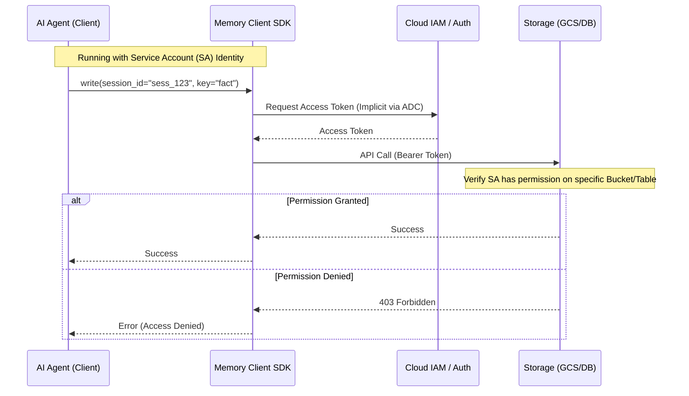
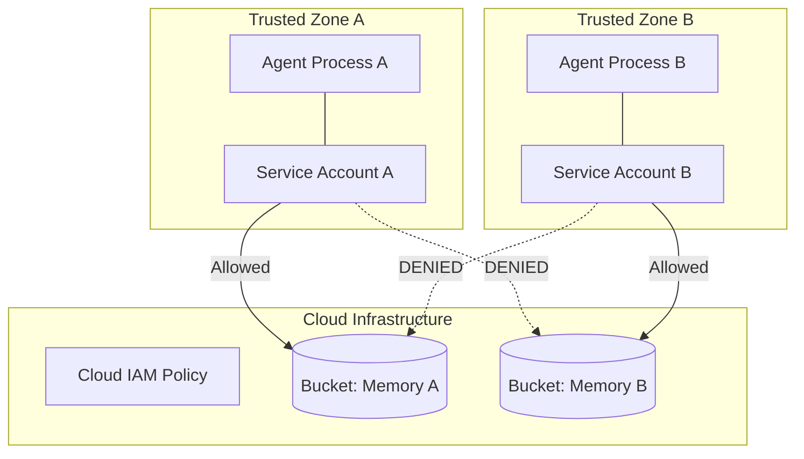

# Security & Access Control Architecture

This document details the security model of **Agent Memory Hub**, specifically how Identity and Access Management (IAM), Service Accounts, and logical isolation work together to secure memory data.

## Identity Model

Agent Memory Hub follows a **Service Identity** model. The "User" in this context is typically an AI Agent process running in a cloud environment (e.g., Cloud Run, GKE, VM).

Access is granted to the **Agent's Identity** (Service Account), not to individual end-users of the agent application.

### Flow Diagram: Authorization Path



## IAM & Permissions

Security is enforced at the **Infrastructure Layer**. The Service Account running the agent need minimal privileges.

### Recommended Roles (Google Cloud)

| Backend       | Recommended Role                                              | Granularity          | Capability                                                                              |
| :------------ | :------------------------------------------------------------ | :------------------- | :-------------------------------------------------------------------------------------- |
| **GCS (ADK)** | `roles/storage.objectCreator`<br>`roles/storage.objectViewer` | **Bucket Level**     | Can only read/write objects in the specific regional bucket. Cannot list other buckets. |
| **Firestore** | `roles/datastore.user`                                        | **Project/Database** | Read/write access to documents. Use Firestore Rules for finer grain.                    |
| **AlloyDB**   | `roles/alloydb.client`                                        | **Instance**         | Ability to connect. Internal DB roles restrict data access.                             |

## Isolation Strategies

How do we recall sure Agent A doesn't read Agent B's memory?

### 1. Logical Isolation (Standard)

- **Mechanism**: The SDK silos data using `session_id` and `agent_id` prefixes in object keys or tables.
- **Setup**: Shared Service Account, Shared Bucket.
- **Trust**: The Agents are trusted code components.
- **Risk**: If Agent A is compromised and modifies the SDK code, it _could_ read Agent B's data because the Identity (SA) has access to the whole bucket.

### 2. Infrastructure Isolation (Strict/Multi-Tenant)

- **Mechanism**: Separate physical resources (Buckets) and Identities (Service Accounts) for different agent groups.
- **Setup**:
  - Agent A runs as `SA-A` -> Has access ONLY to `bucket-region-a`.
  - Agent B runs as `SA-B` -> Has access ONLY to `bucket-region-b`.
- **Benefit**: Even if Agent A is fully compromised, the infrastructure layer denies access to Agent B's bucket.

### Diagram: Strict Isolation Flow



## Configuring Service Accounts

To setup a Service Account (SA) for an agent:

1.  **Create SA**:
    ```bash
    gcloud iam service-accounts create agent-memory-reader
    ```
2.  **Grant Permissions** (Least Privilege):
    ```bash
    # Only grant access to the specific memory bucket
    gsutil iam ch serviceAccount:agent-memory-reader@PROJECT.iam.gserviceaccount.com:objectCreator gs://memory-hub-us-central1-prod
    ```
3.  **Run Agent**:
    - **Local**: `export GOOGLE_APPLICATION_CREDENTIALS="path/to/key.json"`
    - **Cloud Run/GCE**: Attach the Service Account to the instance. The SDK detects it automatically.

## RBAC for Databases (AlloyDB/Redis)

For Database backends, security is two-fold:

1.  **Cloud Access**: IAM controls "Who can connect to the instance".
2.  **Database Access**: Internal users/roles control "Who can read table X".

The SDK supports passing `user` and `password` via configuration to leverage these internal database entry controls.
